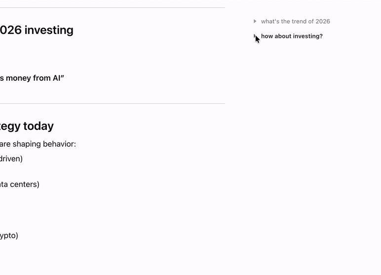

<div align="center">
  
  <h1>EnhanceGPT</h1>
</div>

<p align="center">
  <a href="https://react.dev/"></a>
  <a href="https://www.radix-ui.com/"></a>
  <a href="https://www.npmjs.com/">=10"></a>
  <a href="https://developer.chrome.com/docs/extensions/develop/migrate/what-is-mv3"></a>
</p>
<p align="center">
  <a href="README.md">English</a> · <b>简体中文</b>
</p>

EnhanceGPT 是一个 Chrome 扩展，为 ChatGPT 网页端增加贴近原生体验的批量会话管理、常用提示词片段和会话大纲。它作为轻量增强层实现，避免全屏弹窗、厚重界面和明显的布局位移。

<p align="center">
  快速跳转：<a href="#安装">安装</a> • <a href="#开发">开发</a> • <a href="#功能展示">功能展示</a> • <a href="#实现说明">实现说明</a>
</p>

## 主要功能

- 在左侧会话列表中批量选择对话，提升多会话整理效率。
- 通过聚焦的批量操作界面对选中会话执行归档或删除。
- 在输入框上方用紧凑下拉菜单保存、编辑和复用提示词片段。
- 在右侧空白区域生成轻量会话大纲，便于快速浏览和跳转长对话。
- 保持接近原生、轻量且不打扰的使用体验。

## 功能展示

<table>
  <tr>
    <th>批量操作</th>
  </tr>
  <tr>
    <td></td>
  </tr>
  <tr>
    <th>提示词管理</th>
  </tr>
  <tr>
    <td></td>
  </tr>
  <tr>
    <th>会话大纲</th>
  </tr>
  <tr>
    <td></td>
  </tr>
</table>

## 安装

可以直接从对应浏览器扩展商店安装 EnhanceGPT：

- [Chrome 网上应用店](https://chromewebstore.google.com/detail/enhancegpt/lmldndbkafhldohcojnifbgcodmmbnjg)
- [Microsoft Edge Add-ons](https://microsoftedge.microsoft.com/addons/detail/aaanmffndkllpimlfoomliognpnocbnf)

## 环境要求

- Node.js 20 或更高版本
- npm 10 或更高版本
- 支持 Manifest V3 的 Chrome 或 Chromium 内核浏览器

## 开发

```bash
npm install
```

构建并加载到 Chrome

```bash
npm run build
```

然后在 Chrome 中加载 `dist` 目录：

1. 打开 `chrome://extensions`。
2. 启用开发者模式。
3. 选择“加载已解压的扩展程序”。
4. 选择本仓库的 `dist` 文件夹。

## 项目结构

```text
public/manifest.json        Manifest V3 扩展清单
src/content/                ChatGPT 内容脚本和注入界面
src/shared/                 共享常量和提示词类型
vite.content.config.ts      用于 manifest 内容脚本的 IIFE 构建配置
```

## 实现说明

- 内容脚本作用域为 `https://chatgpt.com/*` 和 `https://chat.openai.com/*`。
- 提示词片段存储在 `chrome.storage.local` 中，非扩展开发环境会回退到 `localStorage`。
- 批量删除和归档按钮当前会触发 `ecg:bulk-conversation-action` 浏览器事件，而不是直接调用 ChatGPT 私有 API。这样可以在稳定、明确的原生操作适配器完成前保持首版实现更稳妥。
- CSS 使用 `ecg-` 前缀，并作为静态内容脚本样式表加载。
- 会话大纲优先使用 ChatGPT 的会话 JSON 端点，让长对话可以在所有消息挂载到 DOM 前完成索引。

## 验证

```bash
npm run typecheck
npm run lint
npm run build
```

## 参考资料

- Chrome Manifest V3 和清单结构：https://developer.chrome.com/docs/extensions/reference/manifest
- 静态内容脚本：https://developer.chrome.com/docs/extensions/reference/manifest/content-scripts
- 扩展存储：https://developer.chrome.com/docs/extensions/reference/api/storage
- 扩展图标：https://developer.chrome.com/docs/extensions/reference/manifest/icons
